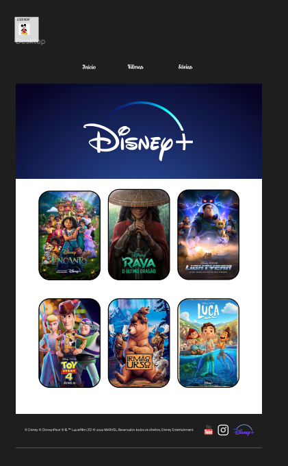

# Projeto de Front-End: Layout Disney

## 📜 Descrição

Este projeto consiste na criação de um site da disney, desenvolvido como parte de um curso de front-end. . Este projeto demonstra a aplicação de conceitos de design e desenvolvimento front-end em um contexto realista.

## 🎨 Layout Fornecido

O layout do projeto foi disponibilizado no Figma.

Este design serviu como base para a construção do site e devia ser seguido para garantir que o resultado final esteja alinhado com as especificações visuais e funcionais fornecidas do curso.

## 🛠️ Tecnologias Utilizadas

O desenvolvimento deste projeto utilizou as seguintes tecnologias e linguagens:

**HTML5:** Estruturação e marcação do conteúdo da página.

**CSS3 com SASS:** Estilização da página, incluindo layout, cores e fontes. Utilização do pré-processador SASS para facilitar a escrita e manutenção do CSS.

**Responsividade:** Design responsivo para garantir a compatibilidade com diferentes dispositivos e tamanhos de tela.

## 📝 Licença

Este projeto está licenciado sob a MIT License.
